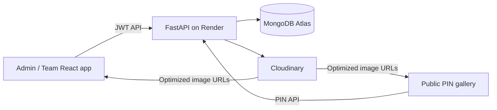

# Event Gallery

An event-photo workflow for administrators, photography team members, and public guests. Admins create private events and galleries; assigned team members upload images; guests view only published galleries after entering the correct PIN.

## Stack

- React, Vite, and Tailwind CSS
- FastAPI, Pydantic, and Swagger API documentation
- MongoDB Atlas (M0 compatible) via Motor
- Cloudinary image storage; JWT, bcrypt, and SlowAPI

## Architecture

## Collections

| Collection | Main fields |
| --- | --- |
| `users` | `_id`, `name`, `email`, `password_hash`, `role`, `created_at` |
| `events` | `_id`, `name`, `created_by`, `team_members`, `created_at` |
| `photos` | `_id`, `event_id`, `uploaded_by`, `filename`, `storage_url`, `storage_key`, `file_size`, `created_at` |
| `galleries` | `_id`, `event_id`, `photo_ids`, `slug`, `pin_hash`, `is_published`, `published_at` |

Passwords and PINs use bcrypt hashes; plaintext PINs are never persisted. Event operations verify ownership or assignment. Storage happens before DB insertion, so a failed upload creates no orphaned photo record. Public gallery access returns 404 before publication, locks that specific gallery for 15 minutes after five incorrect PINs, and also has a broad request-rate limit.

## Local setup

1. Copy `.env.example` to `.env` and configure Atlas, Cloudinary, and a long JWT secret. Put it in `backend/.env` when running from that directory.
2. Backend: `cd backend`, create/activate a virtualenv, then `pip install -r requirements.txt` and `uvicorn app.main:app --reload`.
3. Frontend: `cd frontend`, `npm install`, then `npm run dev`.

Swagger: `http://localhost:8000/docs`. Set `VITE_API_URL` in `frontend/.env` for a non-local API.

## Tests

Run `cd backend && pytest`. The suite targets registration/login, invalid credentials, cross-event isolation, member publication denial, successful/failed storage, and published/unpublished/correct/wrong PIN paths. Point `MONGODB_DB` at a disposable database for integration coverage.

## Deployment

1. Create an Atlas M0 database user and Cloudinary product environment.
2. Deploy the API to Render using `render.yaml`; set `MONGODB_URI`, Cloudinary credentials, `FRONTEND_ORIGIN` (the Vercel domain, with comma-separated local origins only when needed), and `PUBLIC_FRONTEND_URL` (the single Vercel domain used in generated links). Set `SUPER_ADMIN_EMAIL` and `SUPER_ADMIN_PASSWORD` if you want the bootstrap administrator.
3. Import the repository root in Vercel. The included `vercel.json` builds `frontend` and serves its SPA routes from `frontend/dist`.
4. In Vercel, set `VITE_API_URL` to the Render API URL, for example `https://event-gallery-api.onrender.com`.

## Known limitations

- Rate limits are process-local; multi-instance production needs Redis.
- Photo deletion, editing, and direct browser uploads are future enhancements.
